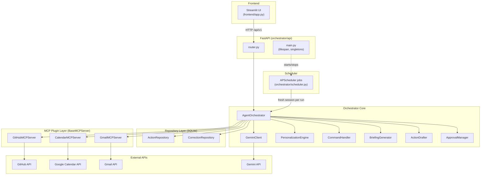

# Architecture — Engineer's Daily Co-pilot

## Overview

Engineer's Daily Co-pilot is a personal agentic assistant that connects to
GitHub, Google Calendar, and Gmail through custom-built MCP plugins,
synthesizes a daily briefing via Gemini, and lets the user issue free-text
commands that get turned into draft actions requiring explicit approval
before anything is sent or scheduled. A SQLite-backed correction log feeds
a personalization loop that influences future drafts based on past edits.

The system runs as two local processes: a FastAPI backend (the
orchestrator, plugins, scheduler, and database) and a Streamlit frontend
that talks to it over HTTP.

## Component Diagram

## Core Components

**MCP Plugin Layer.** Every external integration is a self-contained
folder under `mcp_server/` implementing the `BaseMCPServer` abstract
class — `initialize`, `shutdown`, `list_tools`, `call_tool`, all async.
`MCPRegistry` reads `config/mcp_servers.yaml`, dynamically imports each
enabled plugin's `server.py`, and instantiates it. Adding a new
integration never requires touching orchestrator code.

**Orchestrator Core.** `AgentOrchestrator` is the single point where
plugins, the Gemini client, repositories, and the personalization engine
are wired together via constructor injection. It exposes the operations
the API and scheduler actually call: `get_briefing()`, `handle_command()`,
`approve_action()`, `reject_action()`, `check_ci_failures()`,
`store_correction()`.

**Approval Layer.** `ActionDrafter` turns a parsed command into a
persisted, pending `Action` row. `ApprovalManager` is the only component
allowed to actually execute a side effect (send an email, create a
calendar event) — and only after `approve_and_execute()` is called
explicitly. Nothing reaches GitHub, Calendar, or Gmail without a draft
being shown and approved first.

**Personalization Loop.** `CorrectionRepository` stores every user edit
to a drafted action. `RecencyStrategy` retrieves the most relevant recent
corrections for a given action type, and `PersonalizationEngine` injects
them into the Gemini prompt before generation. This is built as a
strategy interface specifically so an embedding-based retrieval strategy
can be swapped in later without touching the orchestrator.

**Repository Layer.** `ActionRepository` and `CorrectionRepository` wrap
SQLAlchemy sessions around the `Action` and `Correction` tables. Both
share the same `Base` (defined in `models.py`), and schema changes go
through Alembic migrations.

**Scheduler.** `orchestrator/scheduler.py` builds an `AsyncIOScheduler`
with two jobs: a daily morning briefing (`BRIEFING_HOUR`/`BRIEFING_MINUTE`
from settings) and an optional CI-failure poll gated behind
`ENABLE_PUSH_NOTIFICATIONS`. Each job run builds its own `AgentOrchestrator`
and DB session via `build_orchestrator_with_session()` rather than reusing
one held open for the life of the process — see Key Design Decisions below.

**API Layer.** FastAPI exposes 7 endpoints under `/api/v1`
(`/briefing`, `/command`, `/actions/pending`, `/actions/{id}/approve`,
`/actions/{id}/reject`, `/corrections`) plus a root-level `/health` that
also reports `scheduler_running`. `main.py` owns the `registry` and
`gemini_client` singletons and starts/stops the scheduler in `lifespan`.

**Frontend.** A Streamlit app with four pages — Briefing, Command,
Pending Actions, Corrections — calling the API purely over HTTP.

## Key Design Decisions

**Custom MCP plugins instead of pre-built MCP servers.** Decided on Day 2
to keep every integration behind the same `BaseMCPServer` contract
(`list_tools`/`call_tool`/`initialize`/`shutdown`), so the orchestrator,
registry, and tests treat GitHub, Calendar, and Gmail identically. This
trades faster initial setup for long-term consistency and testability.

**Approve-before-execute as a hard boundary.** Every action that mutates
external state — sending an email, creating a calendar event — is
modeled as a row in SQLite with a `PENDING` status that must be explicitly
approved. This was kept as a non-negotiable even under schedule pressure
(see fallback priorities) because the cost of an unintended side effect
(a sent email, a created meeting) is much higher than the cost of an
extra click.

**Strategy pattern for personalization.** `BasePersonalizationStrategy`
is an interface specifically so `RecencyStrategy` (v1, ships in this
project) can later be swapped for an embedding-based strategy behind
`ENABLE_EMBEDDING_PERSONALIZATION` without changing `AgentOrchestrator` or
`CommandHandler`.

**Fresh DB session per scheduled job run, not a cached singleton.** The
first scheduler implementation built one `AgentOrchestrator` (and one
SQLAlchemy session) at startup and reused it for every job run for the
life of the process. This was corrected: holding one session open across
many job runs risks a stale identity map, a session left in a broken
state after an unhandled exception, and SQLite lock contention with
concurrent per-request sessions from the API. `build_orchestrator_with_session()`
now opens and closes a new session for every job execution, mirroring the
per-request lifecycle already used by `get_db()`.

**Tiered email classification.** Tier 1 is a free, heuristic rule-based
filter (domains and subject keywords from `config/tier1_config.yaml`,
merged with user-defined domains from `.env`) that classifies most email
as work/personal without an LLM call. Only genuinely ambiguous email goes
to Tier 2, a batched Gemini classification call — this keeps the system
well under the 15 RPM free-tier cap.

**Feature flags over hard deletes.** Stretch features (`ENABLE_SLACK_PLUGIN`,
`ENABLE_EMBEDDING_PERSONALIZATION`, `ENABLE_PUSH_NOTIFICATIONS`,
`ENABLE_WEEKLY_RETROSPECTIVE`) are all off by default in `config/settings.py`,
so partially-built functionality can land on `main` without being exposed,
and incomplete stretch goals never block a release.